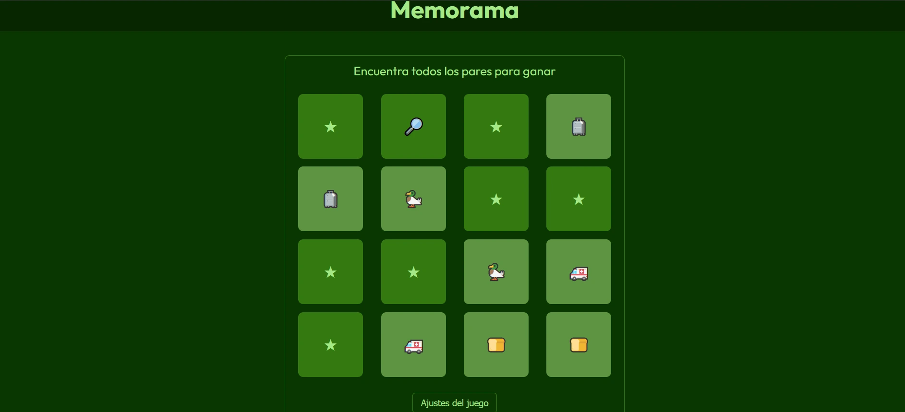

# Memory Game

A simple web-based memory game built with JavaScript, HTML, and CSS with a review system.
Play now on: https://memory-game.devfs.net/

## Features

- Flip cards to find matching pairs
- Responsive design for desktop and mobile
- Hardcore mode with just one try
- Review system with backend included

## How to Play

1. Click on a card to flip it.
2. Find and match all pairs to win.
3. Change the mode in the options menu.
4. Enter a review in the corresponding section.